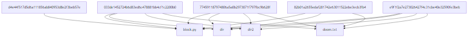

### README.md

---

# Git Dependency Visualizer

Git Dependency Visualizer — инструмент командной строки для анализа и визуализации зависимостей файлов и папок в коммитах Git-репозитория. Генерация графа происходит с использованием синтаксиса **Mermaid**, а результат визуализируется в виде изображения с помощью инструмента **mmdc**.

---

## Описание функций

### Основные функции скрипта:

1. **`get_git_dependencies(repo_path)`**  
   Извлекает зависимости файлов и папок из коммитов указанного Git-репозитория.
   - **Аргументы:**  
     `repo_path` (строка): Путь к локальному Git-репозиторию.
   - **Возвращает:**  
     Словарь, где ключами являются идентификаторы коммитов, а значениями — список файлов и папок.

2. **`generate_mermaid_graph(dependencies)`**  
   Генерирует Mermaid-код для отображения зависимостей в виде направленного графа.
   - **Аргументы:**  
     `dependencies` (словарь): Словарь с зависимостями.
   - **Возвращает:**  
     Строку Mermaid-кода.

3. **`visualize_graph(mermaid_code, visualizer_path)`**  
   Генерирует изображение на основе Mermaid-кода и открывает его в приложении по умолчанию.
   - **Аргументы:**  
     - `mermaid_code` (строка): Mermaid-код графа.
     - `visualizer_path` (строка): Путь к программе `mmdc` для генерации графа.

4. **`main()`**  
   Точка входа в скрипт. Обрабатывает параметры командной строки, вызывает необходимые функции и запускает процесс визуализации.

---

## Установка и настройка

### 1. Установка зависимостей
Для работы требуется:
- **Node.js** (для установки mmdc).
- **mmdc**: Установите Mermaid CLI глобально или локально:
  ```bash
  npm install -g @mermaid-js/mermaid-cli
  ```

### 2. Системные требования
- Python 3.8+
- Git установлен и доступен в PATH.

---

## Использование

### Запуск скрипта
Используйте следующий синтаксис:
```bash
python script.py <visualizer_path> <repo_path>
```

- **`<visualizer_path>`**: Путь к программе `mmdc` (например, `C:\\Users\\User\\AppData\\Roaming\\npm\\mmdc.cmd`).
- **`<repo_path>`**: Путь к локальному Git-репозиторию.

---

### Пример работы

1. **Команда для анализа репозитория:**
   ```bash
   python script.py "C:\\Users\\komko\\AppData\\Roaming\\npm\\mmdc.cmd" ../my_repo
   ```

2. **Результат:**  
   После выполнения команда создаёт файл `graph_output.png` с визуализацией и открывает его.

   

---

## Сборка и тестирование

### Команда для запуска тестов
Для проверки работоспособности функций выполните:
```bash
python -m unittest test_script.py
```

### Результаты тестов
Скриншот с результатами успешного выполнения тестов:


---

## Примеры использования

### Входные данные

Git-репозиторий с историей коммитов:
```plaintext
commit1
file1.txt
file2.txt

commit2
file3.txt
```

### Генерация Mermaid-кода

Mermaid-код, сгенерированный для этого примера:


### Визуализация графа

Результат визуализации в формате PNG:


